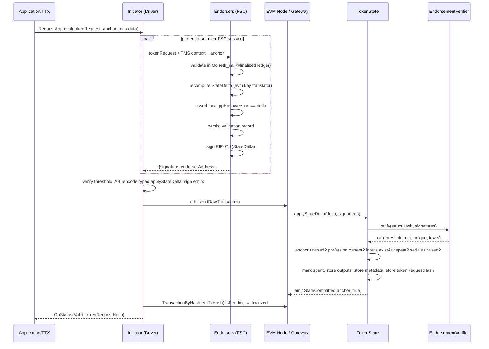

# Ethereum / EVM Network Driver — Design Document (Finalized)

> Branch: `feature/evm-network-driver`. Module: `github.com/LFDT-Panurus/panurus`.
> This is the finalized design. All previously-open decisions are resolved in §15 with rationale grounded in
> the existing codebase; §16 lists the handful worth a non-blocking confirmation from Angelo. The detailed,
> task-level build sequence lives in `eth_network_driver_implementation_plan.md`.

---

## 1. Executive Summary

This document specifies an Ethereum/EVM network driver for the Token SDK (Panurus). It implements
**Approach 2** (pre-order execution with FSC endorsers) from `docs/services/network-ethereum.md`: FSC nodes
validate token requests off-chain in Go, sign the resulting state transition with secp256k1 keys (EIP-712),
and an on-chain contract verifies the endorser signatures plus spent/existence constraints before applying
the transition.

### 1.1 Trust model (the foundation)

The chain performs **no token validation**. `TokenState.applyStateDelta` checks only:
(a) a threshold of authorized endorser signatures, (b) the public-parameters version is current,
(c) declared inputs exist and are unspent / declared serial numbers are unused. It does **not** verify ZK
proofs, value conservation, or issuer authorization. Token correctness is established **entirely off-chain by
the endorser quorum**. The system's security therefore reduces to endorser honesty and key custody. Every
later section assumes this; §14 builds the threat model around it.

### 1.2 What v1 supports

- Both shipped drivers: `fabtoken` and `zkatdlog/nogh`. Both are **graph-revealing** today
  (`IsGraphHiding() == false`, `GetSerialNumbers() == nil`). The graph-hiding path is fully specified but
  dormant until a graph-hiding driver ships.
- A single `TokenState` contract per TMS (a TMS has exactly one token driver).
- One Ethereum transaction per `StateDelta` (a delta is the translation of a whole token request, so it can
  carry many operations).

### 1.3 Resolved key decisions (detail + rationale in §15)

| Area | Decision |
|------|----------|
| Spent/existence | `StateDelta` carries **one** `bytes32[] spentRefs`; the contract holds a `graphHiding` flag (from public params) and branches: graph-revealing => refs are token IDs that must exist & get marked spent; graph-hiding => refs are serial numbers that must not exist & get recorded *(Angelo, one-list steer)* |
| Spend-ref identity | a bare `bytes32` (token ID or serial number); no `Input` struct, no `outputHash`; byte-binding enforced off-chain by endorsers |
| Spent representation | explicit `spent`/`serialUsed` mapping (flag), output bytes retained for audit |
| Hashing | keccak256 for EVM object keys; **SHA-256** for `tokenRequestHash` and `publicParamsHash` (SDK uses SHA-256) |
| Key derivation | one `evm` key translator (analog of `common/rws/keys.Translator`), reproduced by the contract |
| Anchor | `TokenRequestAnchor = SHA-256(nonce ‖ creator)`, decoupled from the Ethereum tx hash |
| Public params | versioned on-chain; updates are **endorsed (quorum-gated)** via a setup delta; mirrors `pp.VersionKeeper` |
| Governance | deployer only **seeds** the initial PP + endorser set; **once the quorum is set it owns everything** (PP updates, endorser-set changes, `setEndorsementVerifier`) *(Angelo)* |
| Endorser identity | bound to both an FSC `view.Identity` (routing) and an Ethereum address (`ecrecover`) |
| Signing | each endorser independently recomputes the delta+digest and signs; **never** blind-signs |
| Backend | **Besu** (acceptance; Angelo 2026-07-08) — standard EVM node; fabric-x-evm is a stretch if time remains |
| Finality | receipt + `eth_getTransactionByHash` polling (primary, any node) + FabricX event queue + `OnlyOnceListener`, read at `finalized` where exposed; gateway `isPending` lifecycle is the fabric-x-evm stretch layer |
| Crypto lib | permissive: `x/crypto/sha3` + `decred/secp256k1`; **go-ethereum must not be linked, even transitively** *(Angelo: license is a hard blocker)* |
| Gas | `eth_estimateGas` × multiplier (EIP-1559 fees); `fixed` only as override |

### 1.4 Out of scope (v1)

Cross-chain interop; contract upgradeability (a minimal-clone deploy path is included, §3.8); ERC-4337
batching/sponsoring (the likely v2 path, §3.9); advanced gas estimation; a graph-hiding token driver;
state-delta compression.

---

## 2. Architecture Overview

### 2.1 Roles

- **Initiator** — the FSC node assembling the transaction: builds the token request, drives endorsement
  collection over FSC sessions, assembles + signs + broadcasts the Ethereum transaction, tracks finality.
- **Endorser** — an FSC node that validates the request in Go, recomputes the `StateDelta`, and EIP-712-signs
  it. Identified by an FSC `view.Identity` (routing) **and** an Ethereum address (on-chain recovery).
- **Submitter** — the account that signs and pays for the Ethereum transaction (gas). May reuse an endorser
  key or be separate.
- **Contracts** — `EndorsementVerifier` (endorser set, threshold, signature verification) and `TokenState`
  (token storage, spent/existence, PP versioning, state application).

### 2.2 Comparison with existing drivers

| Concern | Fabric | FabricX (Approach-2 template) | EVM (this driver) |
|--------|--------|------------------------------|-------------------|
| Validation | chaincode on-chain | FSC off-chain + endorse | FSC off-chain + endorse |
| Backend artifact | RWSet | RWSet (+ read deps) | typed `StateDelta` |
| Endorsement transport | Fabric endorser protocol | FSC views | FSC views |
| Spent semantics | delete/SN keys | delete/SN keys + MVCC read-set | two-list delta + on-chain checks |
| Re-validation at commit | MVCC | MVCC | **contract must do it** (no read-set) |
| Finality | push committer | notification queue | gateway `isPending` + queue |

The EVM driver follows FabricX structurally (it is the Approach-2 template Angelo authored) but emits a
`StateDelta` instead of an RWSet and replaces MVCC re-validation with explicit on-chain checks.

### 2.3 End-to-end flow



### 2.4 Package layout

```
token/services/network/evm/
├── driver.go                # NewDriver(...) DI constructor + Registration (mirrors fabricx/driver.go)
├── network.go               # driver.Network implementation
├── ledger.go                # driver.Ledger adapter (read-only, eth_call@finalized)
├── envelope.go              # driver.Envelope (Bytes/FromBytes/TxID/String)
├── config.go                # config.Service-backed configuration + validation
├── client/                  # EVMClient interface + JSON-RPC client + local Address/Hash types
├── eip712/                  # domain separator, type hashes, digest, secp256k1 signer/verifier
├── keys/                    # evm KeyTranslator (analog of common/rws/keys.Translator)
├── statedelta/              # StateDelta translator (validated actions -> StateDelta)
├── endorsement/             # ServiceProvider (lazy per TMSID), initiator + responder views, identity registry
├── finality/                # poller/manager over gateway isPending, reuses fabricx queue + OnlyOnceListener
├── pp/                      # public-parameters version keeper (analog of fabricx/pp)
└── contracts/               # Solidity sources (EndorsementVerifier, TokenState), ABI, deploy scripts
```

---

## 3. Smart Contracts

### 3.1 Storage layout — TokenState

```solidity
contract TokenState {
    // token data, keyed by tokenID = keccak256(abi.encode(anchor, index))
    mapping(bytes32 => bytes)   tokens;          // tokenID => token bytes (addressable by anchor,index)
    mapping(bytes32 => bool)    snExists;        // graph-revealing: content-bound output markers recorded at creation
    mapping(bytes32 => bool)    snSpent;         // graph-revealing: markers consumed by a spend
    mapping(bytes32 => bool)    serialUsed;      // graph-hiding: serial number seen
    mapping(bytes32 => bytes32) tokenRequestHash; // anchor => SHA-256(tokenRequest)
    mapping(bytes32 => bool)    processedAnchor;  // idempotency / replay guard
    mapping(bytes32 => bytes)   transferMetadata; // metadataKey => value

    bytes   publicParameters;
    bytes32 publicParamsHash;     // SHA-256(publicParameters)
    uint64  publicParamsVersion;  // mirrors pp.VersionKeeper: first set = 0, then +1
    bool    graphHiding;          // set from public params at init/PP-update; selects spentRefs semantics
    address endorsementVerifier;
    address deployer;             // seeds the initial PP + endorser set once; after that the quorum owns all
}
```

Rationale for `spent` flag + retained bytes (vs Fabric's delete): the network driver is the abstraction
boundary, so higher layers only observe `AreTokensSpent`/`QueryTokens` results; retaining bytes preserves
on-chain auditability and lets `getToken` answer for spent tokens. The deleted-key gas refund is marginal and
not worth losing history. See §15.2.

The `graphHiding` flag lets a **single** `spentRefs` list serve both modes: since each TokenState serves one
driver, the mode is fixed per contract and the interpretation of `spentRefs` is unambiguous (Angelo's one-list
steer). See §3.6.

### 3.2 EndorsementVerifier

```solidity
interface IEndorsementVerifier {
    // digest = keccak256(0x1901 || domainSeparator || hashStruct(StateDelta)); TokenState computes it (it
    // owns the domain, whose verifyingContract = address(this)) and passes the final digest — see note below.
    function verify(bytes32 digest, bytes[] calldata signatures) external view returns (bool);

    function isEndorser(address a) external view returns (bool);
    function getEndorsers() external view returns (address[] memory);
    function getThreshold() external view returns (uint256);
}
```

`verify` rules, in order (implemented in `contracts/src/EndorsementVerifier.sol`, PR 2a):
1. `signatures.length ≥ threshold`, else `InsufficientEndorsements`.
2. Recover each signer over the passed `digest` with `ecrecover`; reject malformed signatures: require
   65-byte `{r,s,v}`, `v ∈ {27,28}`, and **low-s** (`s ≤ secp256k1n/2`) to block malleability (EIP-2 style).
3. Each recovered address must be a current endorser and **unique within the call** (so N signatures from one
   endorser are not counted N times — raised by @arner).
4. **Strict semantics: every provided signature must be valid** — the contract does not scan for "at least
   threshold valid among possibly-invalid ones." The initiator assembles the bundle and must only include
   signatures it verified; a partially-invalid bundle is evidence of a broken or malicious initiator, and
   accepting it would mask faults (it also removes any gas incentive to pad the call with junk). Failures
   revert with a typed reason (per §13) rather than returning false.

**Implementation deviations (PR 2a, 2026-07-08):**
- `verify` takes the **final `digest`**, not `structHash`. The digest binds `domainSeparator`, which includes
  `verifyingContract = TokenState`. TokenState is a per-TMS EIP-1167 clone, so it — not a shared/decoupled
  verifier — computes the digest (via `EIP712.digest`); a verifier taking `structHash` would need to know each
  clone's address, a needless coupling and a chicken-and-egg at deploy. `domainSeparator` still binds `chainId`
  + `verifyingContract`, so signatures cannot be replayed across chains or contracts.
- **No `addEndorser`/`removeEndorser`/`setThreshold` in v1.** The deployer seeds the set + threshold at
  construction (immutable thereafter). Per §15.3 the quorum owns governance post-bootstrap, but runtime
  endorser-set mutation is a quorum-gated feature deferred beyond v1 — none of the v1 acceptance flows
  (issue/transfer/redeem/PP-update) mutate the endorser set. Add the mutators + their events when governance
  lands.

### 3.3 TokenState — interface

```solidity
interface ITokenState {
    // delta passed as a TYPED struct (not opaque bytes) so the contract recomputes hashStruct itself.
    function applyStateDelta(StateDelta calldata delta, bytes[] calldata signatures) external returns (bool);

    function getToken(bytes32 tokenID) external view returns (bytes memory);
    function isSpent(bytes32 tokenID) external view returns (bool);
    function areTokensSpent(bytes32[] calldata tokenIDs) external view returns (bool[] memory);
    function isSerialUsed(bytes32 serial) external view returns (bool);
    function getPublicParameters() external view returns (bytes memory);
    function getPublicParamsVersion() external view returns (uint64);
    function getTransferMetadata(bytes32 key) external view returns (bytes memory);
    function getTokenRequestHash(bytes32 anchor) external view returns (bytes32); // SHA-256 value

    event StateCommitted(bytes32 indexed anchor, bool success, string message);
    event PublicParametersUpdated(bytes32 indexed paramsHash, uint64 version);
}
```

Note there is **no** privileged `setPublicParameters(address admin)`: PP updates arrive as an endorsed setup
delta (§3.5), gated by the same threshold as any other state change. Governance (Angelo): the **deployer only
seeds** the initial PP + endorser set; **once the quorum is set it owns everything** — endorser-set changes,
threshold changes, and `setEndorsementVerifier` are all quorum-gated (a threshold-signed admin delta / call),
not deployer privileges (§3.8, §15.3).

### 3.4 applyStateDelta — semantics (replaces Fabric MVCC)

On Fabric/FabricX, the read-dependencies created by `checkInputs` and `AddPublicParamsDependency`
(`StateMustExist`/`StateMustNotExist` → `AddReadAt(version)`) are re-validated at commit by MVCC. The EVM has
no read-set, so `applyStateDelta` performs these checks itself, in this order, reverting with a typed reason:

1. `require(!processedAnchor[delta.anchor])` — else `AnchorAlreadyProcessed`.
2. `structHash = hashStruct(delta)`; `require(verifier.verify(structHash, signatures))` — else `InvalidSignatures`.
3. `require(delta.publicParamsVersion == publicParamsVersion && delta.publicParamsHash == publicParamsHash)`
   — else `StalePublicParams`. (On-chain equivalent of `AddPublicParamsDependency`.)
4. Interpret the single `delta.spentRefs` by mode:
   - if `!graphHiding` (graph-revealing): each `ref` is a **content-bound output marker**; `require(snExists[ref]
     && !snSpent[ref])` — else `InputMissingOrSpent`. Existence of the marker proves the spent token has the
     exact bytes recorded at creation, so forged content is rejected.
   - if `graphHiding`: for each `ref`, `require(!serialUsed[ref])` — else `DoubleSpend`.
5. Metadata keys are **write-once**: `require(!metadataExists[k])` for each — else `MetadataKeyOccupied`.
   (Verified 2026-07-11: the Fabric translator enforces `StateMustNotExist` on every issue/transfer metadata
   key, `translator.go:351/413` — a reused key, e.g. an htlc claim key seen twice, is a validation failure,
   never an overwrite. With no MVCC the contract must re-check it, same as the spent/existence checks.)
6. Apply (all-or-nothing): for each `ref` set `snSpent[ref]=true` (graph-revealing) or `serialUsed[ref]=true`
   (graph-hiding); for each output store `tokens[out.tokenID]=out.tokenData` and record `snExists[out.snMarker]=true`;
   `metadataExists[k]=true` + `transferMetadata[k]=v` for metadata; `tokenRequestHash[anchor]=delta.tokenRequestHash`;
   `processedAnchor[anchor]=true`.
7. `emit StateCommitted(anchor, true, "")`.

`AreTokensSpent(txid, index)` for graph-revealing resolves the token content via `getToken(ComputeTokenID(...))`,
recomputes `OutputSNMarker(anchor, index, content)`, and returns `snSpent[marker]`.

Any failed `require` reverts the whole transaction (atomicity); the finality layer maps the revert to
`Invalid` via the receipt status.

### 3.5 Public-parameters lifecycle (endorsed, versioned)

PP updates are not privileged. The flow mirrors the SDK's `SetupAction` → `commitSetupAction`:
- A setup token request produces a `SetupAction`; the StateDelta translator emits a **setup delta** carrying
  the new `publicParameters` bytes (outputs/inputs empty).
- Endorsers validate and sign it like any delta. `applyStateDelta` (setup variant or a flag on the delta)
  stores `publicParameters`, sets `publicParamsHash = sha256(params)`, and bumps `publicParamsVersion`
  (first set → 0, subsequent → +1, exactly as `pp.VersionKeeper.UpdateVersion`), then emits
  `PublicParametersUpdated`.
- Initial PP v0 and the initial endorser set are seeded by the deployer at deployment (bootstrap), since no
  quorum exists yet.

The driver-side `pp.VersionKeeper` (per TMS) caches the version and is synced from
`getPublicParamsVersion()`; endorsers refuse to sign a delta whose `publicParamsVersion` ≠ their synced value.

### 3.6 Spent / existence model — one list, contract-side mode

Verified opposite polarities in `token/services/network/common/rws/translator/translator.go`:

- **Graph-revealing** (fabtoken, zkatdlog/nogh): each output stored under `CreateOutputKey(anchor,index)`
  **and** `CreateOutputSNKey(anchor,index,outputBytes)`. `checkInputs` requires the input to **exist**
  (`StateMustExist`), `spendInputs` **deletes** it. Spent = absence. `GetInputs()` populated,
  `GetSerialNumbers()` nil.
- **Graph-hiding**: `checkInputs` requires the serial number to **not exist**, `spendInputs` **writes** it.
  Spent = presence. `GetInputs()` empty, `GetSerialNumbers()` populated.

The two modes need opposite on-chain checks, but they do **not** need two lists in the delta. Because each
TokenState serves a single driver, the mode is a fixed property of the contract, carried as the `graphHiding`
flag (set from public params at init/PP-update). So `StateDelta` carries **one** `bytes32[] spentRefs`, and
the contract branches (Angelo's one-list steer, §3.4):
- graph-revealing: each `ref` is a token ID → `tokens[ref]` must exist and `spent[ref]` false → set `spent[ref]`.
- graph-hiding: each `ref` is a serial number → `serialUsed[ref]` must be false → set `serialUsed[ref]`.

`areTokensSpent` mirrors this: graph-revealing returns `spent[ref]`; graph-hiding returns `serialUsed[ref]`.
The driver's off-chain translator produces `spentRefs` from `GetInputs()` (graph-revealing, as token IDs) or
`GetSerialNumbers()` (graph-hiding) — only one is ever non-empty for a given driver.

### 3.7 Token ID derivation

One derivation, defined by the `evm` key translator (§5.2) and reproduced by the contract:

```solidity
function computeTokenID(bytes32 anchor, uint256 index) internal pure returns (bytes32) {
    return keccak256(abi.encode(anchor, index)); // abi.encode is length-safe; never raw-concat
}
```

### 3.8 Deployment (minimal clones)

Per-TMS full-bytecode deployment is costly. Decision (§15.4): deploy one shared `TokenState` implementation +
one `EndorsementVerifier`, then create a per-TMS `TokenState` via **EIP-1167 minimal proxy (clone)** with an
`initialize(verifier, deployer, pp0, graphHiding)` initializer. Minimal clones are cheap and do
**not** introduce upgradeability (which stays out of scope). The shared implementation locks itself in its
constructor so only clones can ever be initialized (PR 2b). NWO/forge scripts perform deployment.

**Initializer front-running (2026-07-11 review):** clone creation and `initialize` are separate transactions
in the current deploy script, so on a shared/public chain an attacker could initialize the clone first with
their own verifier and endorser set (nothing binds `initialize` to the deployer). On the permissioned Besu
target this is a low, but nonzero, risk. Production hardening (plan Week 6, deploy hardening): a small factory
contract whose `create(...)` clones AND initializes in one transaction, making the window impossible; until
then the deploy script must verify post-initialize state (verifier address, PP hash, graphHiding) before
recording the clone address as the TMS contract.

### 3.9 Transaction model / batching

v1: one `eth_sendRawTransaction` per `StateDelta`. Keep `applyStateDelta` internally a function so a future
`applyStateDeltaBatch(StateDelta[])` is additive without an ABI break. ERC-4337 (UserOperations + paymaster
gas sponsoring, removing the need for FSC nodes to hold ETH) is the planned v2 path; it would change
`Broadcast()` and add EntryPoint integration. (Raised by @alexandrosfilios.)

---

## 4. StateDelta and EIP-712

### 4.1 StateDelta (final, typed) — field by field

```solidity
struct OutputToken { bytes32 tokenID; bytes32 snMarker; bytes tokenData; }

struct StateDelta {
    bytes32       anchor;              // TokenRequestAnchor = SHA-256(nonce ‖ creator); NOT the eth tx hash
    bytes32[]     spentRefs;          // one list; content-bound output markers (graph-revealing) OR serials (graph-hiding), per contract graphHiding flag
    OutputToken[] outputs;             // new non-redeem tokens, in deterministic counter order
    bytes32[]     metadataKeys;        // sorted ascending (canonicalization, §4.4)
    bytes[]       metadataVals;        // aligned with metadataKeys
    bytes32       tokenRequestHash;    // SHA-256(tokenRequest)
    bytes32       publicParamsHash;    // SHA-256(publicParameters)
    uint64        publicParamsVersion; // must equal on-chain version at apply time
    bool          isSetup;             // true => setup/PP-update delta (spentRefs/outputs empty, carries new PP)
    bytes         setupParameters;     // present iff isSetup
}
```

One field set, used identically by the Go struct, the EIP-712 type, and the Solidity struct. `spentRefs` is a
single `bytes32[]` (Angelo's one-list steer); there is no `Input` struct. (The original doc had two divergent
`StateDelta` definitions and an EIP-712 type missing `publicParamsHash`.)

### 4.2 EIP-712 encoding

- Domain: `EIP712Domain{ name:"Panurus", version:"1", chainId, verifyingContract:<TokenState clone> }`.
- The type string lists every field above, with the referenced struct `OutputToken` appended per EIP-712
  (`spentRefs`/`metadataKeys` are plain `bytes32[]`, no referenced struct).
- `hashStruct` follows EIP-712: dynamic members (`bytes`, arrays, struct arrays) are hashed per spec;
  `tokenData`/`setupParameters` (`bytes`) hash to `keccak256(value)`; arrays hash to
  `keccak256(concat(encodeElement))`.
- Digest = `keccak256(0x1901 ‖ domainSeparator ‖ hashStruct(StateDelta))`. keccak is mandated by EIP-712 and
  applies to the 32-byte field values; the *values* of `tokenRequestHash`/`publicParamsHash` are SHA-256.

### 4.3 Hashing summary (avoid the keccak/SHA-256 trap)

| Value | Algorithm | Why |
|------|-----------|-----|
| token ID, spent marker, metadata key, EIP-712 digest/structHash | keccak256 | EVM-native, cheap on-chain |
| `tokenRequestHash` | SHA-256 | SDK stores/compares SHA-256 (`translator.go:CommitTokenRequest`) |
| `publicParamsHash` | SHA-256 | SDK PP hash is SHA-256 (`core/common/ppm.go` → `utils.Hashable.Raw()`) |

If the contract must reproduce the SHA-256 values it uses the SHA-256 precompile (address 0x02).

### 4.4 Determinism (identical bytes across all endorsers)

All endorsers must serialize a byte-identical `StateDelta`, else signatures verify against different
`structHash`es. Canonicalize every nondeterministic source:
- `metadataKeys/Vals`: built from a Go `map` (random iteration order in `translator.go:commitIssueAction/
  commitTransferAction`). **Sort by `metadataKey` ascending**, keep `vals` aligned.
- `spentRefs`, `outputs`: emit in deterministic action/counter order. Reproduce the translator
  counter exactly: issue advances by `len(outputs)`; transfer advances by `NumOutputs()` (redeem slots
  included); redeem outputs are skipped (`IsRedeemAt`).

### 4.5 No blind-signing

The endorsement request carries **only** the token request + TMS context + anchor — never a precomputed
digest. Each endorser validates, recomputes the delta from the validated actions via the shared key
translator, checks `publicParamsHash/version`, computes the digest locally, and signs. This is the issue
@atharrva01 raised on the PR: a malicious initiator must not be able to get endorsers to sign a delta that
doesn't match what they validated.

---

## 5. Driver Interface Implementation

Implements `token/services/network/driver/network.go` `Network` (signatures below match exactly).

### 5.1 evm key derivations (`evm/keys`)

The one source of truth for on-chain keys, shared by initiator + endorsers and reproduced by the contract.
These return **`[32]byte`** (not the string keys of `translator.KeyTranslator`): the EVM driver builds its own
StateDelta translator rather than reusing Fabric's RWSet translator, and needs `bytes32`, so the package
exposes EVM-native derivations (as implemented in Phase 1.3):

| Function | Derivation | Used for |
|--------|-----------|-----------|
| `ComputeTokenID(anchor, index)` | `keccak256(abi.encode(anchor, index))` | addressable token id / storage key (queries) |
| `OutputSNMarker(anchor, index, tokenData)` | `keccak256(abi.encode(anchor, index, keccak256(tokenData)))` | **content-bound** graph-revealing spent ref |
| `SpentRefForSerial(serial)` | `keccak256(0x03 ‖ serial)` | graph-hiding spent ref |
| `IssueMetadataKey(subkey)` | `keccak256(0x01 ‖ subkey)` | issue metadata key |
| `TransferMetadataKey(subkey)` | `keccak256(0x02 ‖ subkey)` | transfer metadata key |
| `AnchorFromTxID(txID)` | decode hex-32 | txID string → `bytes32` anchor |

**Content binding (why `OutputSNMarker`, not `ComputeTokenID`, is the graph-revealing spent ref):** the SDK
validator is stateless — the fabtoken transfer validator sets `ctx.InputTokens` from the action's own inputs
(`validator_transfer.go:89`) and checks balance against those, never loading the real on-chain token. So a
spend reference keyed only by `(anchor, index)` would let a spender present forged bytes at a real position.
`OutputSNMarker` binds the token content (mirroring Fabric's `CreateOutputSNKey`): the marker is recorded when
the output is created and referenced by a graph-revealing spend, so forged content yields a marker that was
never recorded and the spend is rejected. `ComputeTokenID` remains the addressable storage key (so
QueryTokens/AreTokensSpent can resolve a `token.ID`).

Class separation uses fixed 1-byte prefixes (mirroring `keys.HashedKeyTranslator`), not ad-hoc
`"SERIAL_NUMBER"` strings. The token-request hash and PP hash are stored directly by the contract keyed by
anchor / fixed slots. `spentRefs` and `snMarker` are opaque `bytes32` to the contract (existence checks only);
all hashing happens off-chain.

### 5.2 StateDelta translator (`evm/statedelta`)

EVM analog of `common/rws/translator`. Consumes **validated actions** (not the raw request); reuses the same
action methods the RWSet translator uses. Surface matches what the responder calls, plus a `StateDelta()`
extractor:

```go
type Translator interface {
    Write(ctx context.Context, action any) error                   // routes Setup/Issue/Transfer
    AddPublicParamsDependency() error                              // sets delta.publicParamsHash + version
    CommitTokenRequest(raw []byte, storeHash bool) ([]byte, error) // SHA-256 -> delta.tokenRequestHash
}
// concrete *Translator additionally exposes: StateDelta() (StateDelta, error)
```

Action → StateDelta mapping:

| Action | Effect |
|--------|--------|
| `SetupAction` | `isSetup=true`, `setupParameters = GetSetupParameters()`, set ppHash/version; empty spentRefs/outputs |
| `IssueAction` | append outputs (`GetSerializedOutputs`), metadata (`GetMetadata`); spentRefs only if the action declares inputs |
| `TransferAction` | append non-redeem outputs (`SerializeOutputAt`, skip `IsRedeemAt`); append to `spentRefs` from `GetInputs()` as token IDs (graph-revealing) **or** `GetSerialNumbers()` (graph-hiding) — one is empty; append metadata |

Counter handling and ordering per §4.4.

### 5.3 Network methods (detailed)

- `Name()` → configured network name; `Channel()` → `""`.
- `Normalize(opt)` → default network if empty, force channel `""`.
- `Connect(ns)` → validate TokenState clone address present, `client.Ping`, `ChainID` matches config, PP
  version keeper synced; return `[]token.ServiceOption{WithNetwork, WithChannel(""), WithNamespace}`.
- `ComputeTxID(id)` → `hex(SHA-256(lenPrefix(id.Nonce) ‖ id.Creator))` = `TokenRequestAnchor`. Length-safe
  (no raw append), independent of chainID/contract and of the eth tx hash.
  **Mutating contract (verified against FSC 2026-07-11, critical):** callers pass `id` with an EMPTY nonce
  and rely on the driver to fill it. FSC's `transaction.ComputeTxID` generates a random 24-byte nonce when
  `id.Nonce` is empty and writes it back into the caller's struct, and the Fabric driver copies the
  nonce/creator back too (`fabric/network.go:350`). The EVM driver must do the same: if `id.Nonce` is empty,
  generate a fresh cryptographically random nonce and assign it to `id.Nonce` before hashing. A pure/read-only
  implementation would derive the SAME anchor for every transaction of a creator, and the second transaction
  ever submitted would revert with `AnchorAlreadyProcessed` (the driver deadlocks in production while passing
  single-transaction demos).
- `NewEnvelope()` → empty `*Envelope`.
- `Broadcast(ctx, blob)` → assert `*Envelope`; `client.SendRawTransaction(rawTx)`; record eth tx hash;
  `finality.Track(anchor, ethTxHash)`.
- `RequestApproval(ctx, tms, requestRaw, signer, txID, metadata)` → `endorsementProvider.Get(tms.ID()).Endorse(...)` (§6).
- `FetchPublicParameters(ns)` → `eth_call getPublicParameters` (opaque bytes, both drivers).
- `QueryTokens(ctx, ns, IDs)` → per ID, `getToken(keys.ComputeTokenID(anchor, index))`.
- `AreTokensSpent(ctx, ns, IDs, meta)` → graph-hiding (`len(meta)!=0`): `isSerialUsed(keys.SpentRefForSerial(sn))`;
  graph-revealing: resolve through the **content-bound marker** (the spent flag is keyed by `snMarker`, not
  `tokenID`), per §3.4 — either a contract `tokenID → spent` mapping populated at output creation, or the
  driver's `getToken(ComputeTokenID)` → recompute `OutputSNMarker(anchor, index, content)` → `snSpent[marker]`.
  (Query-surface decision pinned in the plan's Week 2.) A bare `isSpent(keys.ComputeTokenID(...))` is
  **insufficient** — it ignores content and cannot see the marker-keyed spent flag.
- `GetTransactionStatus(ctx, ns, anchor)` → resolve via indexed `StateCommitted` log by `anchor` → eth tx →
  finality (§7) → `getTokenRequestHash(anchor)`. Returns `(status, tokenRequestHash, message, err)`.
- `LookupTransferMetadataKey(ns, key, timeout)` → poll `getTransferMetadata(CreateTransferActionMetadataKey(key))`
  until found/timeout; context-aware, no bare `time.Sleep`.
- `LocalMembership()` → EVM membership resolving this node's endorser/submitter identities (config-driven).
- `Ledger()` → read-only `driver.Ledger` (`Status`, `GetTransactionStatus`, `GetStates`,
  `TransferMetadataKey`) over `eth_call@finalized`. No mutation path.

### 5.4 Envelope

```go
type Envelope struct {
    Anchor       string   // TokenRequestAnchor
    EthTxHash    string   // filled after Broadcast
    RawTx        []byte   // RLP-encoded signed eth tx
    Delta        StateDelta
    Endorsements [][]byte
}
// implements driver.Envelope: Bytes()/FromBytes()/TxID()=Anchor/String()
```

---

## 6. Endorsement (initiator + responder)

Mirrors `fabric/endorsement/fsc` (initiator.go + responder.go); artifact is a `StateDelta`, signature is
EIP-712. Wired as a lazy `ServiceProvider` keyed by `TMSID` (the `esp.go` pattern).

### 6.1 Identity registry (address ↔ FSC identity)

Endorsement is an FSC view call to another node, addressed by `view.Identity` (the initiator calls
`CollectEndorsements(..., endorsers ...view.Identity)`); the request travels as transient data over an
authenticated FSC session. But endorsers are also Ethereum addresses (for `ecrecover`). The driver maintains a
**registry** mapping each endorser's Ethereum address ↔ FSC `view.Identity`, sourced from config (§9) and/or
the on-chain endorser set. The EndorsementVerifier set alone yields addresses, which cannot route an FSC call.

### 6.2 Responder (`evm/endorsement` responder view)

`receive → authorize → validate → persist → translate → check pp → sign → reply`:

1. **Authorize** the requester by FSC identity (the FSC session authenticates the caller); require membership
   in the configured allowlist for the TMS (default: the TMS network's nodes). This is the EVM analog of the
   Fabric responder's MSP/ACL creator check (no MSP on EVM). See §15.7.
2. **Validate**: `tms.Validator().UnmarshallAndVerifyWithMetadata(ctx, ledger, anchor, requestRaw)` where
   `ledger` is backed by `getState: token.ID → CreateOutputKey → eth_call getToken@finalized`. Yields
   `(actions, meta)`.
3. **Persist** a validation record (request, meta, ppHash) for audit/idempotency, analogous to
   `AppendValidationRecord`.
4. **Translate** actions → `StateDelta` via the StateDelta translator; `AddPublicParamsDependency`;
   `CommitTokenRequest`.
5. **Check pp**: assert `delta.publicParamsVersion == VersionKeeper.GetVersion()`; refuse otherwise.
6. **Sign** the EIP-712 digest; reply `{signature, endorserAddress}`.

### 6.3 Initiator (`evm/endorsement` initiator view)

Collect signatures from the resolved FSC identities; verify threshold/policy; ABI-encode the **typed**
`applyStateDelta(delta, signatures)`; build + sign the eth tx with the submitter key (nonce + gas per §8);
wrap in `Envelope`; return to `Broadcast`.

### 6.4 Messages

```go
type EndorseRequest  struct { TokenRequest []byte; TMSID token.TMSID; Anchor string; Metadata map[string][]byte }
type EndorseResponse struct { Signature []byte; EndorserAddress string; Err string }
```

(No `EIP712Digest` field — endorsers recompute, §4.5.)

---

## 7. Finality

**Backend note (Angelo, 2026-07-08):** the acceptance backend is **Besu**, a standard EVM node; fabric-x-evm
is a stretch. So the **primary** finality path is receipt + standard tx-status polling (works on any node), and
the fabric-x gateway-specific lifecycle (`isPending` semantics, superseded-tx) is an efficiency layer added
only for the fabric-x-evm stretch. Do not build a second tx-state system either way.

### 7.1 Signal and lifecycle

Primary signal (Besu / any standard node): poll the **receipt** together with
`eth_getTransactionByHash(ethTxHash).blockNumber`. Resolution:
- tx known, `blockNumber == null` → still pending, keep polling.
- `blockNumber` set → fetch receipt: status 1 ⇒ `Valid`, status 0 ⇒ `Invalid`.
- tx unknown (never seen / evicted) → `dropped` (treat as `Invalid` after timeout).

**Mapping to SDK status codes (verified vs `network/driver/vault.go`, 2026-07-11):** the SDK's
`driver.ValidationCode` values are `Valid=1`, `Invalid=2`, `Busy=3`, `Unknown=4` — zero is NOT a valid code.
`GetTransactionStatus` and the finality listeners must return: receipt status 1 → `driver.Valid`; receipt
status 0 → `driver.Invalid`; tx known but unmined → `driver.Busy`; anchor/tx never seen → `driver.Unknown`
(escalating to `driver.Invalid` only after the configured finality timeout). Do not conflate the EVM
receipt-status integers (1/0) with the SDK codes.

The `EVMClient.IsPending(txHash) (pending, found, err)` method already abstracts this: on Besu it is backed by
`eth_getTransactionByHash` (`found=false` ⇒ dropped, `blockNumber==nil` ⇒ pending); on the fabric-x-evm
stretch it is backed by the gateway, which additionally exposes the `pending → in-progress → committed |
failed | superseded` lifecycle and the **superseded** case (replacement tx, fabric-x-evm#62: the old hash gets
a synthetic status-0 receipt — resolve to it rather than time out). The superseded handling is fabric-x-only
and not required for the Besu acceptance path.

### 7.2 Confirmation depth

Read at the PoS **`finalized`** block tag (~2 epochs, ~13 min), which removes reorg handling from v1. Optional
later: expose soft (`safe`/included) vs hard (`finalized`) levels to callers. (`confirmationDepth: 12` was a
PoW-era heuristic — @alexandrosfilios.)

### 7.3 Reuse vs replace

- **Reuse directly**: the FabricX finality **event queue** (`fabricx/finality/queue`) for async delivery +
  retry/backpressure, and `OnlyOnceListener` for exactly-once notification — both backend-agnostic.
- **Replace**: `NSListenerManager` / `TxCheck` / `ListenerEvent` (tied to the FabricX committer + queryservice)
  → an EVM manager whose ticks come from receipt + tx-status polling (gateway `isPending` on the fabric-x-evm
  stretch) and whose status check is the §7.1 resolver, enriching `Valid` results with
  `getTokenRequestHash(anchor)`.

### 7.4 Recipient resolution (anchor → finality from chain alone)

A recipient who only saw the token request knows the `anchor`, not the eth tx hash. Resolution must not depend
on the initiator's cache: search logs for `StateCommitted(bytes32 indexed anchor, …)` on the configured
TokenState clone → extract the eth tx hash from the log → receipt/finality → `getTokenRequestHash(anchor)`.
`AddFinalityListener(ns, anchor, listener)` notifies immediately if already final, else once on transition.

**Asymmetry (2026-07-11 review): a recipient can never observe `Invalid` from chain data alone.** A failed
`applyStateDelta` REVERTS, so no `StateCommitted` log is ever emitted for that anchor — log scanning by anchor
only ever discovers success. For an anchor-only listener, `Invalid` is therefore reachable exclusively via the
finality timeout (or via the initiator sharing the eth tx hash out of band, which the design deliberately does
not rely on). Recipient-side listeners must treat "no `StateCommitted` log by the timeout" as `Invalid`; the
timeout is the recipient's only failure signal and must be configured accordingly (§10 `finality.timeout`).

---

## 8. Identity, Signing, Nonce

- **Endorser identity**: secp256k1; Ethereum address = `keccak256(pubkey)[12:]`; registered in
  EndorsementVerifier; bound to an FSC `view.Identity` (§6.1). secp256k1 signing is wired in the driver;
  integrating it into FSC's signer/identity services is real work, not assumed trivial.
  **Address-derivation precision (byte-format traps, 2026-07-11):** the hash input is the 64-byte
  uncompressed public key `X ‖ Y` **without** the leading `0x04` byte —
  `SerializeUncompressed()` returns 65 bytes starting with `0x04`, so strip it before hashing; hashing all 65
  bytes yields a wrong (but plausible-looking) address. Take bytes `[12:32]` of the keccak digest.
- **Signer** (`evm/eip712`): produces 65-byte `{r,s,v}`, `v ∈ {27,28}`, low-s normalized; uses
  `decred/secp256k1` + `x/crypto/sha3` (no go-ethereum).
  **Wire-format precision:** decred's `ecdsa.SignCompact` returns 65 bytes with the recovery byte FIRST
  (`27+recid`, `+4` if compressed — always sign with `compressed=false` so v stays in `{27,28}`), i.e.
  `{v,r,s}`; the Ethereum/contract wire format is `{r,s,v}` with v LAST, so the signer must reorder.
  dcrd signatures are canonical (low-s) by construction, but the signer asserts low-s anyway so a library
  change cannot silently reintroduce malleable signatures. Round-trip test: sign → on-chain-style `ecrecover`
  recovery → expected address.
- **Submitter / NonceManager**: per submitter address; explicit `initialized bool` (never use `nonce == 0` as
  "uninitialized"); tracks in-flight nonces; `RecoverNonce` re-syncs from `PendingNonceAt` and is wired into
  the retry path. A submitter shared across processes needs external coordination (`PendingNonceAt` does not
  see locally reserved nonces) — documented constraint for v1.

---

## 9. Backend Abstraction (`evm/client`)

The interface as implemented in Phase 1.2 (type-safe over the local `Address`/`Hash` types; `IsPending` plus
the receipt give the finality resolver pending vs committed vs dropped):

```go
type EVMClient interface {
    ChainID(ctx context.Context) (*big.Int, error)
    Ping(ctx context.Context) error
    Call(ctx context.Context, to Address, data []byte, blockTag string) ([]byte, error) // e.g. "finalized"
    GetLogs(ctx context.Context, q LogFilter) ([]Log, error)
    PendingNonceAt(ctx context.Context, account Address) (uint64, error)
    EstimateGas(ctx context.Context, msg CallMsg) (uint64, error)
    SuggestGasFees(ctx context.Context) (GasFees, error)
    SendRawTransaction(ctx context.Context, rawTx []byte) (Hash, error)
    GetTransactionReceipt(ctx context.Context, txHash Hash) (*Receipt, error)
    IsPending(ctx context.Context, txHash Hash) (pending bool, found bool, err error)
}
type Receipt struct { TxHash Hash; BlockNumber *uint64; Status uint64; Logs []Log }
type Log struct { Address Address; Topics []Hash; Data []byte; TxHash Hash; BlockNumber uint64 }
type GasFees struct { MaxFeePerGas, MaxPriorityFeePerGas *big.Int }
type CallMsg struct { From, To *Address; Data []byte; Value *big.Int }
```

A JSON-RPC implementation backs this; the driver speaks plain JSON-RPC so it works against any EVM node
including fabric-x-evm. `client` defines local `Address`/`Hash` types. **go-ethereum must not be linked, even
transitively** (Angelo: the license is a hard blocker) — CI should `go mod why` / grep the build graph to
guarantee it. The one place this bites is **raw-transaction (RLP) encoding + signing** in `Broadcast`:
`decred/secp256k1` covers signing, but the RLP encoder and the EIP-1559 tx envelope must be a permissive
implementation (small hand-rolled RLP, or a permissively-licensed lib) — not `go-ethereum/core/types`.
fabric-x-evm already implements `eth_getLogs` with indexed-topic filtering (Storm1289: `gateway/api/eth.go`),
which §7.4 relies on.

---

## 10. Configuration (`evm/config`)

Under `token.tms.<tms-id>.services.network.evm.*`, loaded via `config.Service` (`UnmarshalKey`), with
validation + defaults at load.

```yaml
token:
  tms:
    mytms:
      network: evm
      channel: ""
      namespace: token
      driver: fabtoken              # or dlog
      services:
        network:
          evm:
            endpoint: https://gateway:8545
            chainID: 1
            contracts:
              tokenState: 0x...        # per-TMS clone
              endorsementVerifier: 0x...
            finality:
              blockTag: finalized      # finalized | safe
              pollInterval: 2s
              timeout: 5m
            gas:
              strategy: estimate       # estimate | fixed
              multiplier: 1.2          # estimate * multiplier
              limit: 0                 # used only when strategy=fixed
            endorser:                  # present if this node endorses
              enabled: true
              keystore: /path
              address: 0x...
              fscIdentity: <id>
            submitter:
              keystore: /path
              address: 0x...
            endorsement:
              threshold: 2             # single source of truth (no separate "policy")
              allowlist: [<fscId>, ...]  # who may request endorsement (default: TMS network nodes)
              endorsers:               # address <-> fsc identity binding
                - { address: 0x..., fscIdentity: <id> }
                - { address: 0x..., fscIdentity: <id> }
```

Go structs mirror this; `LoadConfig` validates: endpoint reachable, chainID matches, TokenState present,
threshold ≤ len(endorsers), every endorser has both address and fscIdentity.

---

## 11. Testing

- **Unit**: EIP-712 type/digest vectors; key derivation; StateDelta determinism (sorted metadata, counter
  order, redeem skipping); translator action mapping (issue/transfer/redeem/setup, both graph modes);
  NonceManager (init flag, recovery); config validation; finality resolver (pending/committed/failed/dropped/
  superseded). Mock `EVMClient` + Solidity unit tests (forge) for the contracts.
- **Integration (NWO)**: topology that boots fabric-x-evm (or anvil), deploys EndorsementVerifier + a
  TokenState clone via forge, provisions endorser identities (address ↔ FSC), wires FSC nodes. Cases: issue,
  transfer, redeem, double-spend reject, sub-threshold reject, stale-PP reject, PP update (endorsed) + version
  bump, finality at `finalized`, recipient-side anchor→finality resolution, superseded tx.

---

## 12. Metrics and Logging

Counters/histograms: transactions (submitted/confirmed/failed/latency), endorsements (requested/received/
failed/latency), finality (listeners/notified/polls/latency), contract calls (success/failure/latency), gas
(used/price), errors (nonce conflicts, double-spend attempts, stale-PP). Structured logs via the SDK logger
(`logging.MustGetLogger`).

---

## 13. Error Handling

Typed sentinel errors with `errors.Is` classification (using `fabric-smart-client/pkg/utils/errors`):

| Error | Class | Recovery |
|------|-------|----------|
| `ErrInsufficientEndorsements`, `ErrInvalidSignature` | permanent | reject |
| `ErrDoubleSpend`, `ErrInputMissingOrSpent`, `ErrStalePublicParams`, `ErrMetadataKeyOccupied` | permanent | reject (re-derive request) |
| `ErrNetworkUnavailable`, `ErrNonceConflict` | transient | backoff retry (nonce: re-sync then retry) |
| `ErrTransactionReverted` | permanent | map to `Invalid` via receipt |
| `ErrFinalityTimeout` | transient | continue polling within timeout |
| `ErrInvalidConfiguration`, `ErrMissingContract` | fatal | fail fast at startup |

### Mapping reverts → status
`applyStateDelta` reverts (receipt status 0) map to `Invalid`. The contract's revert reason string is surfaced
in `StateCommitted.message`/the receipt for diagnostics.

---

## 14. Security Considerations

- **Foundational**: security = the endorser quorum (§1.1). Endorser key custody (HSM, rotation, threshold,
  monitoring) is the primary control.
- **Replay**: EIP-712 domain binds chainId + TokenState clone address; `processedAnchor` prevents
  anchor reuse.
- **Front-running** (§15.5): signatures aren't bound to `msg.sender`, so anyone can submit a valid delta; the
  effect is benign (it applies the same valid transition; the original submitter's tx then reverts on
  `processedAnchor`). Accepted for v1.
- **PP governance**: updates are quorum-endorsed (§3.5), not admin-controlled — a single key cannot rewrite
  validation rules.
- **Metadata size**: enforce `MAX_METADATA_VALUE_SIZE` at the approver (zkatdlog metadata can be large and is
  untrusted — @alexandrosfilios).
- **Reorg**: avoided in v1 by reading at `finalized`.
- **Contract audit**: EndorsementVerifier (ecrecover, low-s, uniqueness) and TokenState (atomicity, access on
  deployer-only seeds) are the audit surface.

---

## 15. Resolved Decisions (with rationale)

Items 1, 3, 6, 9 were confirmed by Angelo on 2026-07-02 (DM); the rest are grounded defaults.

1. **One `spentRefs` list + contract `graphHiding` flag** *(Angelo)*. Not two lists. Each TokenState serves a
   single driver, so the mode is fixed per contract; the contract branches on `graphHiding` (from PP): refs
   are token IDs (must exist & get spent) or serial numbers (must not exist & get recorded). Spend-ref
   identity is a bare `bytes32` (no `Input` struct, no `outputHash`) — existence/unspent is checked by the
   ref; byte-binding is enforced off-chain by endorsers, which suffices because the bytes are already on-chain
   and endorsers validate them (Approach-2 trust model).
2. **Spent = flag, bytes retained.** Auditability + simpler queries; the driver boundary hides delete-vs-flag
   from higher layers as long as `AreTokensSpent` is correct. Delete's gas refund is marginal.
3. **Governance: quorum owns everything post-bootstrap** *(Angelo: "once the quorum is set, they can do
   everything")*. The deployer only seeds the initial PP + endorser set; thereafter PP updates (endorsed setup
   delta, versioned like `pp.VersionKeeper`), endorser-set/threshold changes, and `setEndorsementVerifier` are
   all quorum-gated. No standing deployer/admin privilege.
4. **EIP-1167 minimal clones** for per-TMS TokenState: cheap deployment, no upgradeability implication.
5. **Accept benign front-running** in v1; don't bind the submitter (the transition is identical; replay is
   blocked by `processedAnchor`).
6. **No go-ethereum, even transitively** *(Angelo: license is a hard blocker)*. Use `x/crypto/sha3` +
   `decred/secp256k1` + local `Address`/`Hash` types; permissive RLP for raw-tx encoding (§9). CI must fail if
   the build graph pulls go-ethereum.
7. **Endorsement ACL by FSC identity allowlist** over the authenticated FSC session (EVM analog of the Fabric
   MSP/ACL creator check).
8. **Gas via `eth_estimateGas` × multiplier**, EIP-1559 fees from node suggestion; `fixed` only as override.
   ERC-4337 deferred to v2.
9. **Endorser identity** bound to both an FSC `view.Identity` (routing) and an Ethereum address (`ecrecover`).
10. **Module isolation** *(Angelo, Week-1 review: "everything stays under `x/token/services/network/evm` …
    create a go module … the rest of the token-sdk does not depend on this new network driver")*. The driver is
    its own Go module under `x/token/services/network/evm`; the core token-sdk must never import it. The lean
    module also must not import `token/sdk/dig` (it drags core's fabric+idemix graph in and cannot be
    version-reconciled), so the `evmdlog` SDK composition of the driver with a token driver is an
    integration-module concern (plan Week 6 / rule R7).

## 16. Still to confirm with Angelo (non-blocking)

- §15.7 the default endorsement allowlist policy (who may request endorsement) — parked for the endorsement
  work (plan Week 4).
- Minor: `Panurus` as the EIP-712 domain `name` (vs a project-preferred string).

The load-bearing items (spent model, governance, crypto, StateDelta shape) are settled, so the Week-1 freeze
can proceed.

## 17. Implementation Phases (summary)

Frozen-first: (1) StateDelta + evm key translator + on-chain check-list; (2) contracts; (3) StateDelta
translator; (4) EIP-712 + endorsement; (5) driver + network methods + wiring; (6) finality. Task-level detail,
file lists, and acceptance criteria are in `eth_network_driver_implementation_plan.md`.
